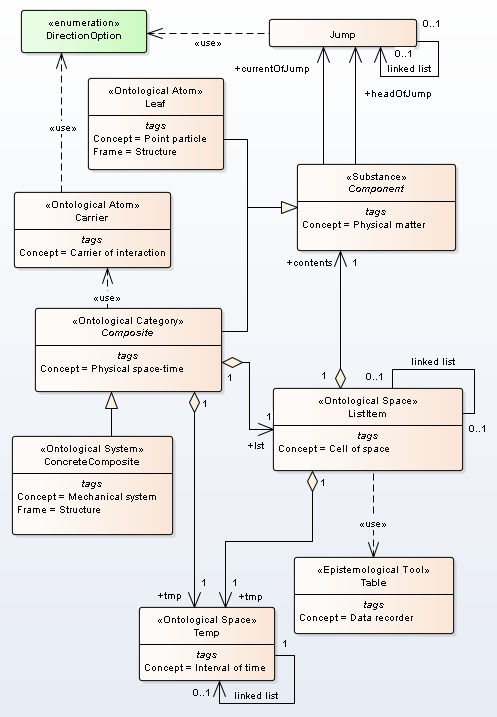
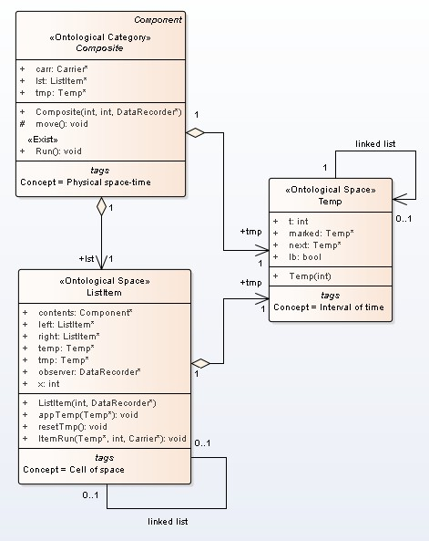

# Analysis model
In UML2 SP, simulation model described as ontology. Classes are considered as the Minsky frames. The language details  view on site  [https://vgurianov.github.io/uml-sp/](https://vgurianov.github.io/uml-sp/)  
  
## 1. Ontology of Special Relativity Theory  
Semantic net definition.  
Classical mechanics concepts can view [here](https://vgurianov.github.io/uml-sp/case_studies/newton/newton).  
In relativistic mechanics, concepts similar concepts of classical mechanics but there are differences. It is synchronization rule of  time of mechanical system and local time of cells.  
Main concepts are Physical space-time, Cell of space, Interval of time, Local Time (it is attribute frame ListItem) , and Synchronization (fig.1). 
  

Figure 1. Ontology of Special Relativity Theory   
  
Also, see  
[Full diagram](Fig1-2-1a.png)  
[Pseudo code C++](cpp.md)  

## 2. Realization of use case "Run"
Use case "Run" realization is depicted in Fig.2.  
  
Figure 2. Communication diagram of operation "Run"  
  
The operation Run() has base cycle on a linked list *tmp*. For each node t, there executed cycle on linked list *lst* and each node *item* get message *itemRun()*.  
If node t has t.lb = true then it is called "bearing" moment of time. Nodes number beatween "bearing" moments is called resolution of tackt of time (\\(\tau_{R} \\)). Variable *tick* is count of "bearing" moments (Tw).  
If node t is "bearing" moment then there executed operation *moveReset()* and *interaction()*. 
  
```
void Run() {
//t=0 is singular point
tick = 0;
Temp *t; t = tmp;
ListItem *item; item = lst;
Carrier *car; car = interaction(car);
item->ItemRun(t, tick, car);

t = t->next;
  while (t != NULL) {

    if (t->lb) {
      tick = tick + 1;
      moveReset();
      car = interaction(car);
    };
                
    item = lst;
    while (item != NULL) {
      item->ItemRun(t,tick, car);
      item = item->right;
    };

  t = t->next;
  };
} 
```
  
## 3. Spacetime model  
We propose a following model of Minkowski spacetime (Fig.3).  
"Composite" class is a model of a physical spacetime. We will view one-dimension space. Physical space is linked list, where lst attribute is base of space (In general case, "headOfList" attribute is base of space, and "tailOfList" is the anchor point and specify the direction in the physical space). Attribute "tmp" is one-direction linked list and it is a model of physical time. Attribute "tmp" is instance of class Temp.  
Class "ListItem" is model of a physical space cell. The cell has a local time; it is "tmp" attribute.  
The time of "Composite" class and the time "ListItem" class must be synchronization.   

Figure 3. Minkowski spacetime model

The synchronization mechanism is a following process. Operation “Run” of class Composite has cycle by linked list “tmp”. For each node tt of linked list "tmp" sended message runItem(tt) to all cells of space (Fig.4).  
  
Figure 4. 	Communication process of synchronization


In procedure runItem(tt), tt compared with attribute "marked" of current node of "tmp" (lt on Fig.4). If tt equals "marked" then linked list "tmp"  shift to next node (operation nextTemp() on Fig.4). This is jump (tick) of local time of cell. If cell has the particle then time of particle also make shift (operation Run() on Fig.4).
```  
void ItemRun(Temp *tt, int tGlob, Carrier *c) {
  if (tmp != NULL) {
    if (tt == tmp->marked) {
      // ---- some activity  ----
      };
    tmp = tmp->next;  // time shift in cell
    };
  };
}
```      
Both Newton's time and time of special relativity has same synchronization mechanism but different rule of define "marked" label. In Newton's mechanics, the time of "Composite" class and the time "ListItem" class have same lengths of linked list "temp" and label "marked" has same number with number of node "temp".    
Time of special relativity has following rule. We take more details grid. Let *size* be resolution of one time tact then  *k x size* is length list *tmp*. Each *size* node *tmp* is marked as lb = true; it is "bearing" node.   
Further, cells mark as
```  
Temp *tt; ListItem *ll; int s,t,x; Temp *st;
tt = tmp;
while (tt != NULL) {
  if (tt->lb) { // It is "bearing" moment of time
    ll = lst;
    while (ll != NULL) {
      s = tt->t; x = ll->x;
      t = sqrt(s*s + x*x); //use ceil,floor
      if (t<size) {
        st = tmp;
	for (int i = 0; i < t; i++) st = st->next;
	ll->appTemp(st);
      };
      ll = ll->right;
    };
  };
tt = tt->next;
};
```  	
i.e. used formula is  \\( ct = \sqrt{s^2 + x^2}  \\).  
The operation appTemp(st) create new node of type Temp in cell and mark it as *st* (see Fig.5).
  
Figure 5. 	Example of linked list tmp for cells 20 and 80  


## 4. Mechanical motion  and interaction  

If local time has shift and cell has particle then possible motion particle and interaction.   
Mechanical motion and interaction are depicted in fig.6.   
  
Figure 6. 	Mechanical motion and interaction 
   
In Pseudo code, we have  
  
 ```  
void ItemRun(Temp *tt, int tGlob, Carrier *c) {
  if (tmp != NULL) {
    if (tt == tmp->marked) {
      if (contents != NULL) {// here particle
        if (contents->isActive) {
	  contents->jumpp();  // shift list Jump
	  oneJump(); // we move particle to the next cell
	} else {
	  contents->Run();  // time shift in particle
	  // Data write to table
	  observer->fixIt(tGlob, tt->t, x, tt->t, contents->tick);
	  contents->doImpact(c); // interaction
	  observer.detect(tGlob,c); // observe act of interaction
	};
      };
    tmp = tmp->next;  // time shift in cell
    };
  };
}
```  
  
If the particle is active then the particle remove from cell 1 and place in cell 2. 
If the particle isn't active then particle time has shift and the particle has interaction.  
Let \\(\tau_{R}\\) be the resolution of tackt of time and  \\( j \\) list length *Jump*.  
The particle not can has velocity more then light speed as count jumps are not more than \\( \tau_{R} \\) even if \\( j > \tau_{R} \\). If  \\( j =  \tau_{R} \\) then particle time is stop and interaction is inpossible.  
If *j* = 0 then time and interaction as in classical mechanics. If  \\( 0 < j <  \tau_{R} \\) then particle time is slows down and intensivity of interaction is falls.  
 

## 5. Measurements
All epistemology entities has standard types (int, bool, and itc.).  
We define the unprimed system foolow.  
- Space cells marked numbers from 0 to Nmax. It is variable x class ItemList.  
- Time interval marked number from 0 to Nmax. It is variable t class Temp.  
- Counter of bearing (abutting) node (lb = true) is variable "tick". 
- In all cells put detector of location and interaction. It is variable "observer" of class Table.  
  
We define time of particle (the primed system) as variable "tick" class Component.  
  
Operation of measurement is depicted in Fig.7  
  
Figure 7. 	The measurement  
  
Message fixIt() send if cell isn't empty and tt = tmp.lb. Operation fixIt() write x,t, and other variable to table.  
  
Main measurement is count. Absolute error of measurement then is 0.5.  
A unit of measurement is "thing" or "piece". A dimensional unit is dimensionless quantity.  
This system of measurement we call "natural" units, SI and CGS is called "standard" units.    
Let \\(\tau\\) be the time, \\(\rho\\) distance, and \\(\mu \\) mass in natural units.  
By \\(\tau_{R} \\) denote the resolution of tackt of time.  
Then time \\(t\\), distance \\(d\\), and mass in standard units calculate as  
   
\begin{align}   
    &t = \frac{\tau}{\nu_{t}} , dim~ \nu_{t} = T^{-1} , \\   
    &d = \frac{\rho}{\nu_{x}} ,  dim~\nu_{x} = L^{-1} , \\   
    &m = \frac{\mu}{\nu_{m}} ,dim~ \nu_{m} = M^{-1} ,  \\    
\end{align}  
   
where \\(\nu_{t}, \nu_{x}, \nu_{m} \\) are the coefficient of conversion time,distance, and mass.   
Cinematics.  
Velocity measure in tackts:
  
$$
\begin{align}
\beta = \frac{v}{c} = \frac{\rho}{k\tau_{R}} ,\\  
\end{align}
$$   
  
where k is count tackts, \\(\rho\\) is distance traveled.  
Dynamics.  
Let \\(\iota_{i} \\) be count of interaction acts on tackt *i* (interaction intensity).  
Force *f* is  
  
$$
\begin{align}  
f_{i}/c = \frac{1}{\nu_{m}} \frac{\nu_{t}}{\tau_{R}^2} \iota_{i} \\
\end{align} 
$$  
  
Formula output.  
Interaction \\(\iota \\) change list *Jump* and, сonsequently, particle velocity.   
We have  
  
$$
\begin{align*}
\Delta p / \Delta t = f \\
\end{align*}  
$$  
  
We get  
  
$$
\begin{align*}
\Delta p / \Delta t &= \frac{1}{\Delta t} 
(\frac{m_{0}v_{i}}{\sqrt{1-\beta_{i}^2}}-
\frac{m_{0}v_{i-1}}{\sqrt{1-\beta_{i-1}^2}})\\  
&= \frac{m_{0}c}{\Delta t} 
(\frac{\beta_{i}}{\sqrt{1-\beta_{i}^2}}-\frac{\beta_{i-1}}{\sqrt{1-\beta_{i-1}^2}})\\
&= \frac{m_{0}c}{\Delta t} 
(\frac{\Delta\rho_{i}/\tau_{R}}{\sqrt{1-\beta_{i}^2}}-
\frac{\Delta\rho_{i-1}/\tau_{R}}{\sqrt{1-\beta_{i-1}^2}})\\
&= \frac{m_{0}c}{\tau_{R}/\nu_{t}} (\frac{\Delta\rho_{i}/\tau_{R}}{\sqrt{1-\beta_{i}^2}}-
\frac{\Delta\rho_{i-1}/\tau_{R}}{\sqrt{1-\beta_{i-1}^2}})\\
&= c\times m_{0}\frac{\nu_{t}}{\tau_{R}^2} (\frac{\Delta\rho_{i}}{\sqrt{1-\beta_{i}^2}}-
\frac{\Delta\rho_{i-1}}{\sqrt{1-\beta_{i-1}^2}})\\
&= c\times m_{0}\frac{\nu_{t}}{\tau_{R}^2} 
(\frac{j_{i}}{\sqrt{1-\beta_{i}^2}}-\frac{j_{i-1}}{\sqrt{1-\beta_{i-1}^2}})\\
&= c\times m_{0}\frac{\nu_{t}}{\tau_{R}^2} 
(\iota/\mu)\\
&= c\times\frac{\mu}{\nu_{m}}\frac{\nu_{t}}{\tau_{R}^2} (\iota/\mu)\\
\end{align*}  
$$  
  
where \\(\mu \\) is list length *Skip*, *j* is list length *Jump*.  
We used substitution
  
$$
\begin{align*}
\Delta t = \frac{\tau_{R}}{\nu_{t}}, \beta = \frac{\Delta \rho}{\tau_{R}},\\  
\end{align*}  
$$  
  
and  
  
$$
\begin{align*}
\iota/\mu = \frac{j_{i}}{\sqrt{1-\beta_{i}^2}}-\frac{j_{i-1}}{\sqrt{1-\beta_{i-1}^2}}.\\  
\end{align*}  
$$  
  
Finally, we obtain 
  
$$
\begin{align*}  
\frac{1}{\nu_{m}}\frac{\nu_{t}}{\tau_{R}^2}  \times \iota = \frac{f}{c}   \\
\end{align*} 
$$  
  
