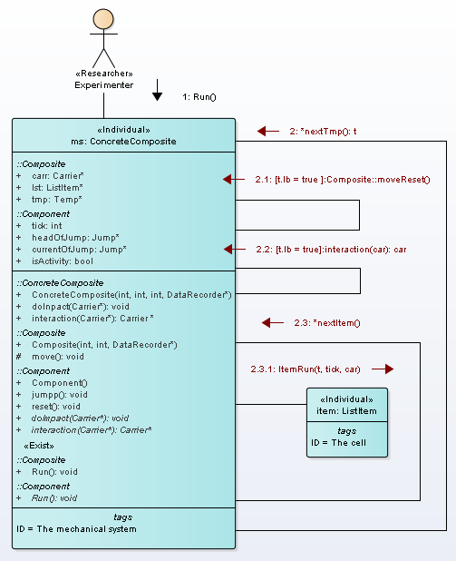

# Analysis model
In UML2 SP, simulation model described as ontology. Classes are considered as the Minsky frames. The language details  view on site  [https://vgurianov.github.io/uml-sp/](https://vgurianov.github.io/uml-sp/)  
  
## 1. Ontology of Special Relativity Theory  
Semantic net definition.  
Classical mechanics concepts can view [here](https://vgurianov.github.io/uml-sp/case_studies/newton/newton).  
In relativistic mechanics, concepts similar concepts of classical mechanics but there are differences. It is synchronization rule of  time of mechanical system and local time of cells.  
Main concepts are Physical space-time, Cell of space, Interval of time, Local Time (it is attribute frame ListItem) , and Synchronization (fig.1). 
  

Figure 1. Ontology of Special Relativity Theory   
  
Also, see  
[Full diagram](Fig1-2-1a.png)  
[Pseudo code C++](cpp.md)  

## 2. Realization of use case "Run"
Use case "Run" realization is depicted in Fig.2.  
  
Figure 2. Communication diagram of operation "Run"  

## 3. Spacetime model  
We propose a following model of Minkowski spacetime (Fig.3).  
"Composite" class is a model of a physical spacetime. We will view one-dimension space. Physical space is linked list, where lst attribute is base of space (In general case, "headOfList" attribute is base of space, and "tailOfList" is the anchor point and specify the direction in the physical space). Attribute "tmp" is one-direction linked list and it is a model of physical time. Attribute "tmp" is instance of class Temp.  
Class "ListItem" is model of a physical space cell. The cell has a local time; it is "tmp" attribute.  
The time of "Composite" class and the time "ListItem" class must be synchronization.   

Figure 3. Minkowski spacetime model

The synchronization mechanism is a following process. Operation “Run” of class Composite has cycle by linked list “tmp”. For each node tt of linked list "tmp" sended message runItem(tt) to all cells of space (Fig.4). 

Figure 4. 	Communication process of synchronization


In procedure runItem(tt), tt compared with attribute "marked" of current node of "tmp" (lt on Fig.4). If tt equals "marked" then linked list "tmp"  shift to next node (operation nextTemp() on Fig.4). This is jump (tick) of local time of cell. If cell has the particle then time of particle also make shift (operation Run() on Fig.4).
```  
void ItemRun(Temp *tt, int tGlob, Carrier *c) {
  if (tmp != NULL) {
    if (tt == tmp->marked) {
      if (contents != NULL) {// here particle
	contents->Run();  
	// Data write to table
	observer->fixIt(tGlob, tt->t, x, tt->t, contents->tick);
	contents->doImpact(c); // interaction
	observer.detect(tGlob,c); // observe act of interaction
      };
    tmp = tmp->next;  // time run in cell
    };
  };
}
```      
Both Newton's time and time of special relativity has same synchronization mechanism but different rule of define "marked" label. In Newton's mechanics, the time of "Composite" class and the time "ListItem" class have same lengths of linked list "temp" and label "marked" has same number with number of node "temp".    
Time of special relativity has following rule. We take more details grid. Let *size* be resolution of one time tact then  *k x size* is length list *tmp*. Each *size* node *tmp* is marked as lb = true; it is "bearing" node.   
Further, cells mark as
```  
Temp *tt; ListItem *ll; int s,t,x; Temp *st;
tt = tmp;
while (tt != NULL) {
  if (tt->lb) { // It is "bearing" moment of time
    ll = lst;
    while (ll != NULL) {
      s = tt->t; x = ll->x;
      t = sqrt(s*s + x*x); //use ceil,floor
      if (t<size) {
        st = tmp;
	for (int i = 0; i < t; i++) st = st->next;
	ll->appTemp(st);
      };
      ll = ll->right;
    };
  };
tt = tt->next;
};
```  	
i.e. used formula is  \\( ct = \sqrt{s^2 + x^2}  \\).  
The operation appTemp(st) create new node of type Temp in cell and mark it as *st* (see Fig.5).
  
Figure 5. 	Example of linked list tmp for cells 20 and 80  


## 4. Mechanical motion  and interaction
Both mechanical motion and interaction models in SRT as in classical methanic.  
Mechanical motion is depicted in fig.6.   
  
Figure 6. 	Mechanical motion  
  
If particle is active then the particle remove from cell 1 and place in cell 2 
 

## 5. Measurements
All epistemology entities has standard types (int, bool, and itc.).  
We define the unprimed system foolow.  
- Space cells marked numbers from 0 to Nmax. It is variable x class ItemList.  
- Time interval marked number from 0 to Nmax. It is variable t class Temp.  
- Counter of bearing (abutting) node (lb = true) is variable "tick". 
- In all cells put detector of location and interaction. It is variable "observer" of class Table.  
  
We define time of particle (the primed system) as variable "tick" class Component.  
  
Operation of measurement is depicted in Fig.7  
  
Figure 7. 	The measurement  
  
Message fixIt() send if cell isn't empty and tt = tmp.lb. Operation fixIt() write x,t, and other variable to table.  
  
Main measurement is count. Absolute error of measurement then is 0.5.  
Result of measurement is called "natural" units, SI and SGS is called "standard" units.  
Let \\(\tau,\rho, \mu \\) be the time, distance, and mass in natural units.  
Let \\(\tau_{R} \\) be the resolution tackt of time.  
We will use International System of Units (SI) ([m], [s], [kg]). Time we will measurement in unit 1/c (metr of light time, i.e. \\(3.335640 \times 10^{-9}\\)seconds or 33 nanoseconds), where *c* is the speed of light.  
Then time \\(t\\) and distance \\(d\\) in standard units calculate as  
   
$$
\begin{align*}
t = \frac{\tau}{\nu_{t}} , d = \frac{\rho}{\nu_{x}} , m = \frac{\mu}{\nu_{m}} \\  
\end{align*}
$$  
   
where \\(\nu_{t}, \nu_{x}, \nu_{m} \\) are the coefficient of conversion time,distance, and mass.   
Further, we will assume that \\(\nu_{t} = \tau_{R} \\) and \\(\nu_{x} = \nu_{t}\\).   
Velocity measure in tackts:
  
$$
\begin{align*}
\beta = \frac{v}{c} = \frac{\rho}{k\tau_{R}} \\  
\end{align*}
$$   
  
where k is count tackts.  
Dynamic.  
Let \\(\iota_{i} \\) be count of interaction acts in moment tG (interaction intensity). Interaction \\(\iota_{i} \\) change list *Jump* and, сonsequently, particle velocity.   
Force *f* is  
  
$$
\begin{align*}  
f = \frac{1}{\nu_{m}} \frac{\nu_{t}}{\nu_{R}} \frac{1}{\nu_{R}} \iota_{i} \\
\end{align*} 
$$  
  
Formula output  
We have  
  
$$
\begin{align*}
\iota / \mu &= j_{i} - j_{i-1} \\  
&= \Delta \rho_{i} - \Delta \rho_{i-1} \\  
&= (\beta_{i} -\beta_{i-1}) \times \nu_{R} \\  
\end{align*}  
$$  
   
Finally, we obtain 
  
  
$$
\begin{align*}  
\frac{f}{m} \times \frac{\nu_{R}}{\nu_{t}} \times \nu_{R}  = \iota / \mu \\
\end{align*} 
$$  
  
