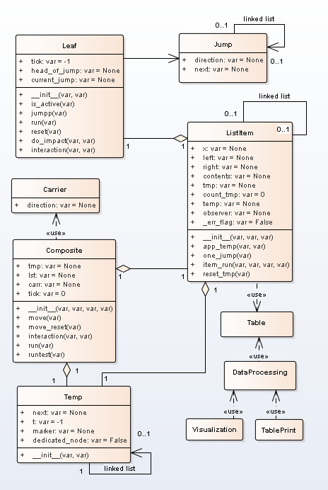
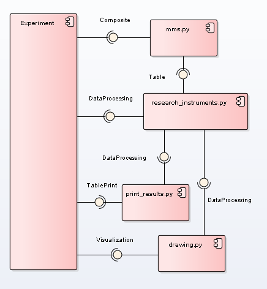
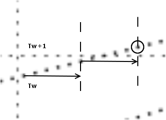

# Design model  
  
## 1. Class diagram
Disign model make to Python. The class diagram depicted in Fig.1   


  
Figure 1. Class diagram  

## 2. Components
Classes are placed in four modules. Component diagram is depicted in Fig.2  
  
  
Figure 1. Class diagram   
  
Module mms include Jump, Carrier, Leaf, Temp, and Composite classes.
Module resacher_instruments  include Table and DataProcessing classes.  
Module print_result  include TablePrint  class.  
Module graphs  include Visualization  class.  
  
  
## 3. Sync errors  
Error in moment Tg = 8 
  
```
Parameters:
countTick= 10 sizeTick= 10
Particle_velosety= 5 ,i.e beta = v/c = 0.5
Time count = 100
Particle velosety = 5

...
World time = 7
Particle tick=: 7
ListItem is act: for tt=marked= 79 ListItem= 35 tloc= 7
World time = 8
World time = 9
Sync error: Particle reset but cell= 40  not sync
Particle tick=: 8
ListItem is act: for tt=marked= 92 ListItem= 45 tloc= 8

```  
The cause of the error is shown in fig. 3  
  
Figure 3. Sync error  
  
This error has if  \\( Tg+1 < \sqrt{Tg^2+x_{i}^} \). We used variable *key* to spy the error.  
This problem has solution.  
