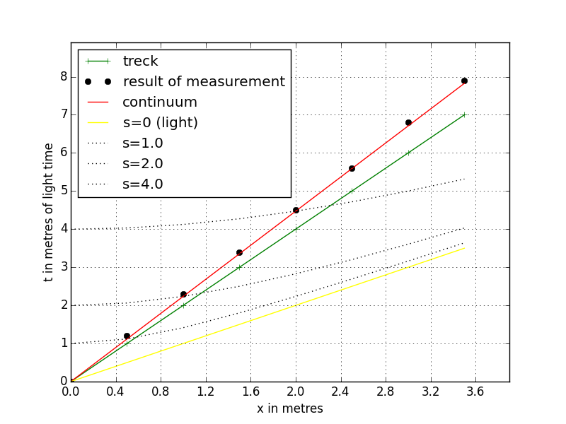

# Time dilation
Modul mms.experiment1 is simulate kinematic relitivistic effects.
  
## 1. Experiment description  
Table 1. Measure result for v = 0.4  
countTick= 7 sizeTick= 10  
Particle_velosety= 5 ,i.e= 0.5 [m]/[m]  
Time count = 70  
Particle velosety = 5  
nu_t = 10.0 , nu_x = 10.0 , nu_m = 1.0  
mass = 1 , lightVel = 1.0  
  
  
## 2. Results of experiment
In Table 1 is depicted result of simulation.  
  
```
Trajectory of particle and time particle
+----+-----+-----+------+------+----+
| Tw |  x  |  t  |  ta  | err% | tp |
+----+-----+-----+------+------+----+
| 0  | 0.0 | 0.0 | 0.0  | 0.0  | 0  |
| 1  | 0.5 | 1.2 | 1.12 | 7.33 | 1  |
| 2  | 1.0 | 2.3 | 2.24 | 2.86 | 2  |
| 3  | 1.5 | 3.4 | 3.35 | 1.37 | 3  |
| 4  | 2.0 | 4.5 | 4.47 | 0.62 | 4  |
| 5  | 2.5 | 5.6 | 5.59 | 0.18 | 5  |
| 6  | 3.0 | 6.8 | 6.71 | 1.37 | 6  |
+----+-----+-----+------+------+----+
```
  
Column Tw is number of tact of model time. Column ta is analytic calculation to formula ta = sqrt(s2+x2). Column x - coordinate of particle in moment t. Column tp is time of particle.  
This result is depictid on fig.1


  
Figure 1. A Minkowski spacetime diagram 

We observe time dilation. In particle, elapse tp units of time but in motionless frame of reference register tobs units of time.
  
We processing of data and calculate of incline k (green line)  
  
```
Analytical incline k_an= 2.24 ,1/v= 2.0
pair points method (d=4)
0 20 45 2.25
1 20 44 2.2
2 20 45 2.25
Point count = 3
Measurement incline k_ar= 2.23 ,k_err%= 0.12
k_ar = 2.23 +/- 0.017
Experimental error of measurement t is  0.05
```  

In case of small velocity, graph depicted in Fig.6

## 3. Description of experiment3 modul
  
### Class "freeMotion"  

Description: the class is a simulation model  
Bases: mms.Composite   
`def __init__(self, sizeTick, countTick, particle_velosety, observer)`  
  
Name | Type | Description  
---- | ---- | ----------- 
sizeTick | int | size of time tact
countTick | int | count of tacts
particle_velosety | int | inicial speed particle
observer | Table instance | Detector and recorder


Operations:

def interaction(self, car)
Description: none interaction
Parameters: "car" is "Currer" instance  

### Class "originalToolkit"

Description: new procedures join to processor of data
Bases: ResacherInstruments.DataProcessing  
`def __init__(self, observer,particle_velosety, sizeTick, countTick)`  
  
Name | Type | Description  
---- | ---- | ----------- 
observer | Table instance | Detector and recorder
particle_velosety | int | inicial speed particle
sizeTick | int | size of time tact
countTick | int | count of tacts
  
#### Operations:      
**def incline(self)**  
Description: incline k calculate and error  
Parameters: None  
  
Algorithm:  
Analytical incline ka can deduce from formula of invariant interval  
\( s^2 = x^2 + t^2\).  From \(x=vs -> s=x/v \) then
\(t' = \sqrt(s^2 + x^2) = \sqrt((x/v)^2 + x^2) = x \sqrt(1+1/v^2)\), i.e.  
\( a_{an} = \sqrt(1+1/v^2)\)  
  
    
$$
\begin{align*} 
x = \frac{mc^2}{qE} \Big( \sqrt{ 1 + (\frac{qEt}{mc})^2 } -1 \Big)  \\  
v = c \sqrt{\frac{(qEt/mc)^2}{1+(qEt/mc)^2} }   \\  
\end{align*} 
$$  

### Class "originalPrint"
Description: rewrite procedure xtPrintPrettyTable
Bases: printResult.TablePrint
