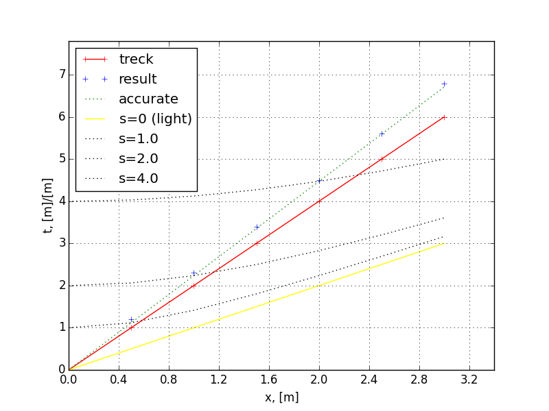

Experiment 1
mms.experiment modul

        1.1. Slowing down of time
In Table 1 is depicted result of simulation. Column gTime is number of step (button "Tick"). Column Time-Anl is analytic calculation to formula t = sqrt(s2+x2). Column Time is t0, i.o. time in motionless frame of reference. Column x - coordinate of particle in moment gTime. Column pTime is time of particle. Column localTime is local time in cell x.
Table 1. Measure result for v = 0.4
Tick
x = vTick
tp
tobs
tacc
Err,%

  
Figure 2. Use-Case diagram 

We observe slowing down of time. In particle, elapse tp units of time but in motionless frame of reference register tobs units of time.
Following is an example of a graphic and caption (“Figure” style).

We processing of data and calculate of incline k (green line)

and

Analytic incline is (k_an) kacc = 2.69 ,1/v= 2.5
Measured incline is (k_ar) km = 2.7 0.01, (k_err%)  = 0.2%
In case of small velocity, graph depicted in Fig.6
