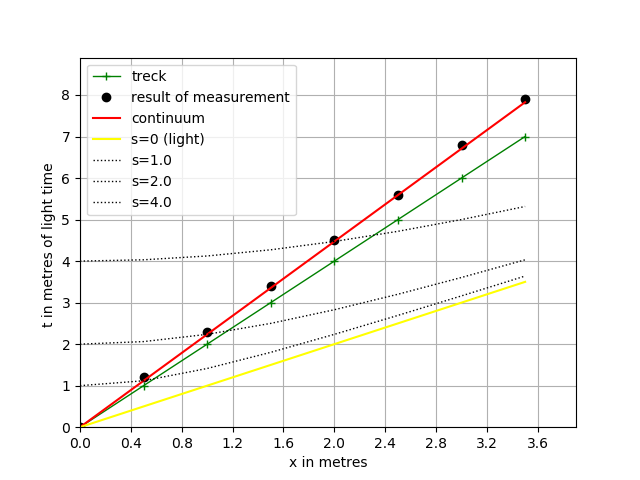

# Time dilation
Modul mms.experiment1 is simulate kinematic relitivistic effects.
  
## 1. Experiment description  
Estimated calculation for \\(\pi ^+\\) meson (pion):  
 Time we measure in metre of light time, i.e. \\(3.335640 \times 10^{-9}\\) seconds.  
 Lifetime is \\( \tau_{0} =  2.6 \times 10^{-8} \\) seconds or  7.8  metres of light time.     
 \\(\beta = v/c = 0.5  \\).  
 Moving pion has a longer decay time \\( \tau =  \frac{\tau_{0}}{\sqrt{1 -\beta ^2 }}  = 3.0 \times 10 ^{-8}\\)  seconds or  9.0  metres of light time.  
 Distance \\( d =  c \times \beta \times \tau_{0}  = 4.5 \\) metres,  
 i.e. we must consider grid 10 x 10.
  
Parameters of experiment:  
countTick= 7, sizeTick= 10  
Particle_velosety= 5 ,i.e v/c = 0.5  
Time count = 70  
nu_t = 10.0 , nu_x = 10.0 , nu_m = 1.0  
mass = 1 , lightVel = 1.0  
  
  
## 2. Results of experiment
In Table 1 is depicted result of simulation.  
  
```
Trajectory of particle and time particle
+----+-----+-----+------+------+----+
| Tw |  x  |  t  |  ta  | err% | tp |
+----+-----+-----+------+------+----+
| 0  | 0.0 | 0.0 | 0.0  | 0.0  | 0  |
| 1  | 0.5 | 1.2 | 1.12 | 7.33 | 1  |
| 2  | 1.0 | 2.3 | 2.24 | 2.86 | 2  |
| 3  | 1.5 | 3.4 | 3.35 | 1.37 | 3  |
| 4  | 2.0 | 4.5 | 4.47 | 0.62 | 4  |
| 5  | 2.5 | 5.6 | 5.59 | 0.18 | 5  |
| 6  | 3.0 | 6.8 | 6.71 | 1.37 | 6  |
+----+-----+-----+------+------+----+
```
  
Column Tw is number of tact of model time. Column ta is analytic calculation to formula \\(ta = \sqrt{s^2+x^2}\\) . Column x - coordinate of particle in moment t. Column tp is time of particle.  
This result is depictid on Fig.1


  
Figure 1. A Minkowski spacetime diagram for \\(\beta  =  0.5\\)    

We observe time dilation. In particle, elapse tp units of time but in motionless frame of reference register tobs units of time.  
  
We processing of data and calculate of incline k (green line)  
  
```
Analytical incline k_an= 2.24 ,1/v= 2.0
pair points method (d=4)
0 20 45 2.25
1 20 44 2.2
2 20 45 2.25
Point count = 3
Measurement incline k_ar= 2.23 ,k_err%= 0.12
k_ar = 2.23 +/- 0.017
Experimental error of measurement t is  0.05
```  

In case of small velocity, plot depicted in Fig.2
  
Figure 2. A Minkowski spacetime diagram for \\(\beta =  0.2 \\)    
  
## 3. Description of experiment3 modul
  
### Class "freeMotion"  

Description: the class is a simulation model  
Bases: mms.Composite   
`def __init__(self, sizeTick, countTick, particle_velosety, observer)`  
  
Name | Type | Description  
---- | ---- | ----------- 
sizeTick | int | size of time tact
countTick | int | count of tacts
particle_velosety | int | inicial speed particle
observer | Table instance | Detector and recorder


Operations:

def interaction(self, car)
Description: none interaction
Parameters: "car" is "Currer" instance  

### Class "originalToolkit"

Description: new procedures join to processor of data
Bases: ResacherInstruments.DataProcessing  
`def __init__(self, observer,particle_velosety, sizeTick, countTick)`  
  
Name | Type | Description  
---- | ---- | ----------- 
observer | Table instance | Detector and recorder
particle_velosety | int | inicial speed particle
sizeTick | int | size of time tact
countTick | int | count of tacts
  
#### Operations:      
**def incline(self)**  
Description: incline k calculate and error  
Parameters: None  
  
Algorithm:  
Analytical incline \\(k_{an}\\) can deduce from formula of invariant interval  
\\( s^2 = c^2t^2 - x^2  \\)  
From  
\\( x = vs -> s = x/v \\)  
then  
\\( t = \sqrt{s^2 + x^2} = \sqrt{(x/v)^2 + x^2} = x \sqrt{1+1/v^2} \\) ,  
i.e.  
\\( a_{an} = \sqrt{1+1/v^2} \\)  
  
The experiment data processing is  
\\( \Delta t = t_{i} - t_{i-4}  \\)  
\\( \Delta x = x_{i} - x_{i-4}  \\)  
\\( k_{i} = \Delta t/\Delta x  \\)  
\\( k_{ar} = \frac{1}{n}\sum_{i=0}^{n} k_i \\)  
  
The standard deviation is  
\\( sk_{ar} = \sqrt{D/(n-1)} \\)  
The confidence interval is  
\\( dk_{ar} = sk_{ar}/\sqrt(n) \\)  
\\( k_{ar} = k_{ar} \pm dk_{ar} \\)  

### Class "originalPrint"
Description: rewrite procedure xtPrintPrettyTable
Bases: printResult.TablePrint
