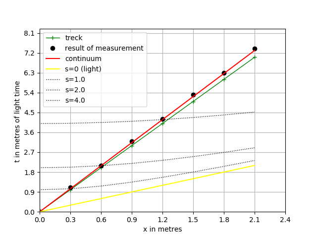

# Time dilation
Modul mms.experiment1 is simulate kinematic relitivistic effects.
  
## 1. Experiment description  
Estimated calculation for \\(\pi ^+\\) meson (pion):  
 Time we measure in metre of light time, i.e. \\(3.335640 \times 10^{-9}\\) seconds.  
 Lifetime is \\( \tau_{0} =  2.6 \times 10^{-8} \\) seconds or  7.8  metres of light time.     
 \\(\beta = v/c = 0.5  \\).  
 Moving pion has a longer decay time \\( \tau =  \frac{\tau_{0}}{\sqrt{1 -\beta ^2 }}  = 3.0 \times 10 ^{-8}\\)  seconds or  9.0  metres of light time.  
 Distance \\( d =  c \times \beta \times \tau  = 4.5 \\) metres,  
 i.e. we must consider grid 10 x 10.
  
Parameters of experiment:  
count_tick= 8, size_tick= 10  
Particle_velosety= 5 ,i.e v/c = 0.5  
Time count = 80  
nu_t = 10.0 , nu_x = 10.0 , nu_m = 1.0  
mass = 1 , lightVel = 1.0  
  
  
## 2. Results of experiment
In table is depicted result of simulation.  
  
```
Trajectory of particle and time particle
+----+-----+-----+------+------+-----+
| Tw |  x  |  t  |  ta  | err% |  tp |
+----+-----+-----+------+------+-----+
| 0  | 0.0 | 0.0 | 0.0  | 0.0  | 0.0 |
| 1  | 0.5 | 1.2 | 1.12 | 7.33 | 1.0 |
| 2  | 1.0 | 2.3 | 2.24 | 2.86 | 2.0 |
| 3  | 1.5 | 3.4 | 3.35 | 1.37 | 3.0 |
| 4  | 2.0 | 4.5 | 4.47 | 0.62 | 4.0 |
| 5  | 2.5 | 5.6 | 5.59 | 0.18 | 5.0 |
| 6  | 3.0 | 6.8 | 6.71 | 1.37 | 6.0 |
| 7  | 3.5 | 7.9 | 7.83 | 0.94 | 7.0 |
+----+-----+-----+------+------+-----+
```
  
Column *Tw* is number of tact of model time.  Column x - coordinate of particle in moment *Tw*. Column *tp* is time of particle.  We observe time dilation. In particle, elapse *tp* units of time but in rest frame of reference register *t* units of time.  
Column *ta* is analytic calculation to formula \\(ta = \sqrt{s^2+x^2}\\) . 
Value *ta* compare with *t*  
  
$$
\begin{align*} 
\epsilon =  \bigl| \frac{t_{a} - t}{t_{a}} \bigr| \times 100 % \\
\end{align*}  
$$  
  
It is column *err%*.  
  
This result is depicted in Fig.1. Black "o" is result of measurement. The red line is analytical value.   


  
Figure 1. A Minkowski spacetime diagram for \\(\beta  =  0.5\\)    

We processing of data and calculate of incline k (green line)  
  
```
Experimental error of measurement t is  0.05
Point couple method (d=4)
0 20 45 2.25
1 20 44 2.2
2 20 45 2.25
3 20 45 2.25
Couple count = 4
Measurement incline k_ar= 2.24
k_ar = 2.24 +/- 0.012

Analytical incline k_an= 2.24, k_err%= 0.12  

```  

In case of small velocity, plot depicted in Fig.2.
  
Figure 2. A Minkowski spacetime diagram for \\(\beta =  0.3 \\)    
  
  
## 3. Description of experiment1 modul
  
### Class "FreeMotion"  

Description: the class is a simulation model  
Bases: mms.Composite   
`def __init__(self, size_tick, count_tick, particle_velosety, observer)`  
  
Name | Type | Description  
---- | ---- | ----------- 
size_tick | int | size of time tact
count_tick | int | count of tacts
particle_velosety | int | inicial speed particle
observer | Table instance | Detector and recorder


Operations:

def interaction(self, car)
Description: none interaction
Parameters: "car" is "Currer" instance  

### Class "OriginalToolkit"

Description: new procedures join to processor of data
Bases: ResacherInstruments.DataProcessing  
`def __init__(self, observer,particle_velosety, sizeTick, countTick)`  
  
Name | Type | Description  
---- | ---- | ----------- 
observer | Table instance | Detector and recorder
particle_velosety | int | inicial speed particle
size_tick | int | size of time tact
count_tick | int | count of tacts
  
#### Operations:      
**def incline(self)**  
Description: incline k calculate and error  
Parameters: None  
  
Algorithm:  
Analytical value of incline \\(k_{an}\\) can deduce from formula of invariant interval  
\\( s^2 = c^2t^2 - x^2  \\)  
Let \\(t'\\) be fix moment of time then distance be \\(x = vt' \\).  
We have \\(s = ct' \\) if \\(x = 0 \\).  
We obtain    
\\( ct = \sqrt{s^2 + x^2} = \sqrt{(cx/v)^2 + x^2} = x \sqrt{1 + c^2/v^2} \\) .  
The result is  
\\( a_{an} = \sqrt{1 + c^2/v^2} \\)  
  
The experiment data processing is  
\\( \Delta t_{i} = t_{i} - t_{i-4}  \\)  
\\( \Delta x_{i} = x_{i} - x_{i-4}  \\)  
\\( k_{ar} = \frac{1}{N}\sum_{i=4}^{n} \Delta t_{i} / \Delta x_{i} \\),  
wher N is count of couples.  

The standard deviation is  
\\( sk_{ar} = \sqrt{\operatorname {Var}(k_{ar}) / (N-1)} \\), where \\(\operatorname {Var}(k_{ar}) \\)  is  variance and *N* is count of pair. 
The confidence interval is  
\\( dk_{ar} = sk_{ar}/\sqrt{N} \\)  
  
Then  
\\( k_{ar} = k_{ar} \pm dk_{ar} \\)  

### Class "OriginalPrint"
Description: rewrite procedure xtPrintPrettyTable
Bases: print_results.TablePrint
