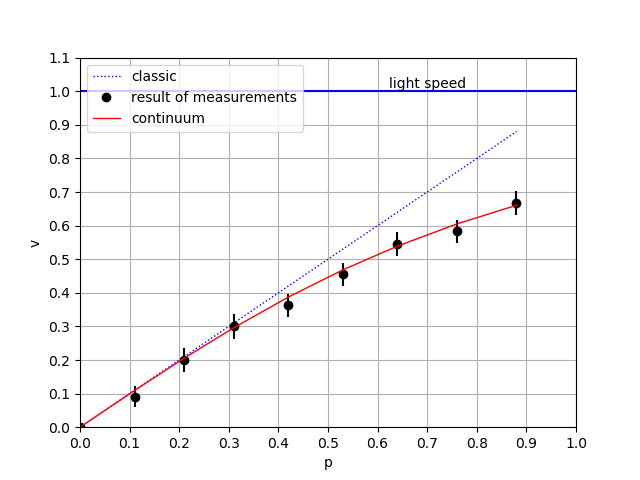

# Velocity, momentum, and energy
Module experiment2.py simulated dynamic relativistic effects.  
  
## 1. Experiment description
We consider motion of charge *q* in constant electric field \\( \mathcal{E} \\). Motion equation is  

\begin{equation}
    \frac{dp}{dt} = q \mathcal{E}  ,\\ 
\end{equation}
  
where \\(p\\) is particle momentum, \\( q \mathcal{E} \\) is force.  
Initial condition is \\(x = 0, p = 0\\) in moment \\(t = 0\\).  
If \\(t > z = mc/q \mathcal{E} \\) then appear relativistic effects.  
References: Charles Kittel, Walter D.Knight, Malvin A. Ruderman, Mechanics. Berkeley physics course. Vol.1, McGraw-Hill book company. 1965  
  
We find dependence  
- particle coordinate x from time t
- particle velocity v from momentum p
- particle energy E from momentum p.  

Estimated calculation for electron:  
\\(m_{0} = 9.1 \times 10^{-31}\\)  kg, \\(q = 1.602 \times 10^{-19}\\) C  
We consider simple case when \\(\mu = 1\\)  (*Skip* list is NULL) and \\(\iota = 1\\) (one act of interaction in tick),    
then  
nu_m =  1.1e+30, nu_t =  3.0e+09  
f = 2.7e-23  N, \\( \mathcal{E} \\) = 1.7e-04  V/m,  
z =  10.0 s, d =  4.14  m  
 
  
We will be calculated motition in \\(c = 1, m_{0} = 1\\) units. We introduce new  variables \\(t' = ct\\) and \\(p' = p/m_{0}\\). If we replace \\(t\\) by \\(t/c\\) and \\(p\\) by \\(m_{0} p\\) in motion equation, we obtain  
  
\begin{equation}
    \frac{dp}{dt} = \frac{q \mathcal{E}}{m_{0}c}  
\end{equation}
  
and \\(f = 0.1, \nu_{t} = 10, \nu_{x} = 10\\)  
  
Variable values:  
count_tick= 8, size_tick= 10  
particle_velosety = 0  (initial velocity)  
nu_t = 10.0 , nu_x = 10.0 , nu_m = 1.0  
mass = 1 , light_vel = 1.0  
  
With this resolution, you can perform 8 clock cycles of the system (if Tw = 9 then an error typical of relativistic models arises, which can be called “synchronization failure”).  


## 2. Results of experiment

The results experiment are shown in Table 1. It is the trajectory of the particle. 
```
Analytical (xa, pa, va) and numerical (xe) solution
+----+-----+-----+------+------+------+------+-----+------+
| Tw |  t  |  x  |  xa  |  xe  |  p   |  pa  |  v  |  va  |
+----+-----+-----+------+------+------+------+-----+------+
| 0  | 0.0 | 0.0 | 0.0  | 0.0  | 0.0  | 0.0  | 0.0 | 0.0  |
| 1  | 1.1 | 0.1 | 0.06 | 0.12 | 0.11 | 0.11 | 0.0 | 0.11 |
| 2  | 2.1 | 0.3 | 0.22 | 0.33 | 0.21 | 0.21 | 0.0 | 0.21 |
| 3  | 3.1 | 0.6 | 0.47 | 0.62 | 0.31 | 0.31 | 0.0 | 0.3  |
| 4  | 4.2 | 1.0 | 0.85 | 1.05 | 0.42 | 0.42 | 0.0 | 0.39 |
| 5  | 5.3 | 1.5 | 1.32 | 1.56 | 0.53 | 0.53 | 0.0 | 0.47 |
| 6  | 6.4 | 2.1 | 1.87 | 2.16 | 0.64 | 0.64 | 1.0 | 0.54 |
| 7  | 7.6 | 2.8 | 2.56 | 2.88 | 0.76 | 0.76 | 1.0 | 0.61 |
| 8  | 8.8 | 3.6 | 3.32 | 3.67 | 0.88 | 0.88 | 1.0 | 0.66 |
+----+-----+-----+------+------+------+------+-----+------+
```  
Values t,x,p, and v are measurement data, values xa, pa, va are analitical solution (see class "originalToolkit"), xe - numerical solution.  
Following is the plot of the trajectory (Fig.1).
  
Figure 1. Motion plot  
  
The data are presented so that speed and energy can be considered as functions of the momentum.  
```  
Velocity and energy of the particle as a function from momentum  
+----+------+------+------+--------+------+------+--------+
| Tw |  p   |  v   |  va  | v,err% |  E   |  Ea  | E,err% |
+----+------+------+------+--------+------+------+--------+
| 0  | 0.0  | 0.0  | 0.0  |  0.0   | 1.0  | 1.0  |  0.0   |
| 1  | 0.11 | 0.09 | 0.11 | 16.86  | 1.01 | 1.01 |  0.39  |
| 2  | 0.21 | 0.2  | 0.21 |  2.68  | 1.03 | 1.02 |  0.8   |
| 3  | 0.31 | 0.3  | 0.3  |  1.32  | 1.06 | 1.05 |  1.25  |
| 4  | 0.42 | 0.36 | 0.39 |  6.09  | 1.1  | 1.08 |  1.42  |
| 5  | 0.53 | 0.45 | 0.47 |  2.94  | 1.15 | 1.13 |  1.61  |
| 6  | 0.64 | 0.55 | 0.54 |  1.19  | 1.21 | 1.19 |  1.91  |
| 7  | 0.76 | 0.58 | 0.61 |  3.59  | 1.28 | 1.26 |  1.91  |
| 8  | 0.88 | 0.67 | 0.66 |  0.91  | 1.36 | 1.33 |  2.1   |
+----+------+------+------+--------+------+------+--------+
```  
   
The following notation is introduced in this table: Tw is the system time step number, p is the measured pulse, v is the measured speed, va is the exact value of the speed, v, err% is the relative error of the speed measurement in%, E is the measured energy, Ea is the exact energy value, E, err% - relative error of energy measurement in %.  
The plot of the dependence of speed on momentum is shown in Fig. 2.  
  
Figure 2. Velocity as function from momentum  
  
Points are measurement data, a continuous line is an analytical curved. The dash line is a numerical solution (Euler's method). For clarity, a plot of the dependence of speed on momentum for the classical case is also given (straight line).  
The plot of the dependence of energy on momentum is shown in Fig. 3.  
  
Figure 3. Energy as function from momentum  
  
Points are measurement data. The dash line is a numerical solution (Euler's method). The continuous line is an analytical curved and compute on formula (see operation engCalculation of class mms.ResacherInstruments.DataProcessing)
  
$$
\begin{equation}  
E = \sqrt{m_{0}^2c^4 + p^2c^2 }   \\  
\end{equation}  
$$   
  
   
Formula \\(E_{0} = m_{0}c^2\\) can output from follow.
Let particle be rest and force act to its.
Then the particle has start of motion with delay \\(\tau_{d} \\)  
  
$$
\begin{equation}  
\tau_{d} =   \tau_{R} \frac{\mu}{\iota} \\  
\end{equation}  
$$   
  
We get \\(\mu\\) and multiplying both sides by \\( c^2/\nu_{m} \\)
  
$$
\begin{equation}  
c^2 \frac{\mu}{\nu_{m}} = c^2 \frac{1}{\nu_{m}} \times \frac{\tau_{d} \iota}{\tau_{R} }  \\  
\end{equation}  
$$   
 
We get
  
$$
\begin{align*} 
c^2 m &= c^2 \frac{1}{\nu_{m}} \times \frac{\tau_{d}}{\tau_{R}} \times \iota  \\  
&= c^2 \frac{1}{\nu_{m}} \times \frac{\tau_{d} }{\tau_{R} } \times \nu_{m} \frac{\tau_{R}^2}{\nu_{t}} \frac {f}{c} \\  
&=   c \tau_{d}  \frac{\tau_{R}}{\nu_{t}} f \\  
&=   \tau_{d} \times c \Delta t f \\  
\end{align*} 
$$  
  
Combination of right side has dimension of work and we may by \\(E_{0}\\) denote string \\(\tau_{d}  c \Delta t f \\).  
So, the rest energy is the result of a delay in the start of particle motion.  
  
  
## 3. Description of experiment2 modul

### Class "SimpleIteraction"
Description: The class is a simulation model  
Bases: mms.Composite    
`def __init__(self, size_tick, count_tick, particle_velosety, observer)`  
  
Name | Type | Description  
---- | ---- | ----------- 
size_tick | int | size of time tact
count_tick | int | count of tacts
particle_velosety | int | inicial speed particle
observer | Table instance | Detector and recorder
  
#### Operations: 
def interaction(self, car)  
Description:  action of electric field  
Parameters: "car" is "Currer" instance  
    
### Class "OriginalToolkit"   
Description: new procedures join to processor of data  
Bases: resacher_instruments.DataProcessing    
`def __init__(self, observer,particle_velosety, sizeTick, countTick)`  
  
Name | Type | Description  
---- | ---- | ----------- 
observer | Table instance | Detector and recorder
particle_velosety | int | initial speed particle
size_tick | int | size of time tact
count_tick | int | count of tacts

#### Attributes: 
  
Name | Type | Description  
---- | ---- | ----------- 
xa_track | int array | x, analitical solution  
xn_track | int array| x, numerical solution 
pa | int array| momentum, analitical solution  
va | int array| velocity, analitical solution  
vn | int array| velocity, numerical solution
en | int array| energy, numerical solution
  
  
#### Operations: 
**def anl_solution(self)**  
Description: accurate x (analytical formula)  
Parameters: None  
  
Algorithm: 
  
$$
\begin{align*} 
&x = \frac{m_{0}c^2}{q \mathcal{E}} \Big( \sqrt{ 1 + (q \mathcal{E} t / m_{0}c)^2 } -1 \Big)  \\  
&v = c \sqrt{\frac{(q \mathcal{E} t/m_{0}c)^2}{1+(q \mathcal{E} t/m_{0}c)^2} }   \\  
\end{align*} 
$$  
  
References: Charles Kittel, Walter D.Knight, Malvin A. Ruderman, Mechanics. Berkeley physics course. Vol.1, McGraw-Hill book company. 1965  
  
**def num_solution(self)**  
Description: numerical solution of motion differential equation  (Euler's method)   
Parameters: None  
  
Algorithm: 
  
$$
\begin{align*}  
&p_{i} = p_{i-1} + q \mathcal{E} \Delta t \\  
&v_{i} = \frac{p_{i}} {\sqrt{m_{0}^2 + p_{i}^2 / c^2 } }\\  
&x_{i} = x_{i-1} + v_{i} \Delta t  \\  
&e_{i} = e_{i-1} + q \mathcal{E} \Delta x \\  
\end{align*}  
$$  
  
where \\(p_{0} = 0\\), \\(v_{0} = 0\\),  \\(e_{0} = m_{0}c^2\\).  
  
Value \\(x_{i}\\) write to array *xn_track*, value \\(v_{i}\\) write to array *vn*, value \\(e_{i}\\) write to array *en*.  
    

    
