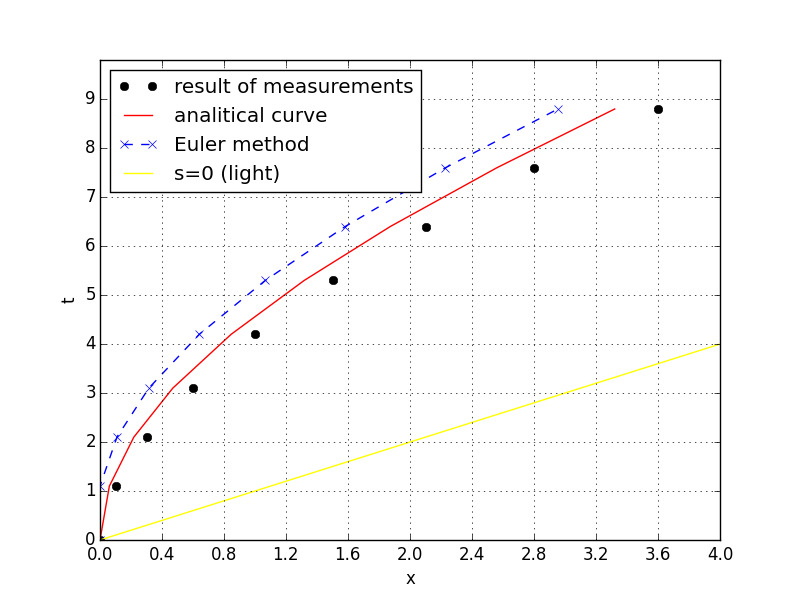
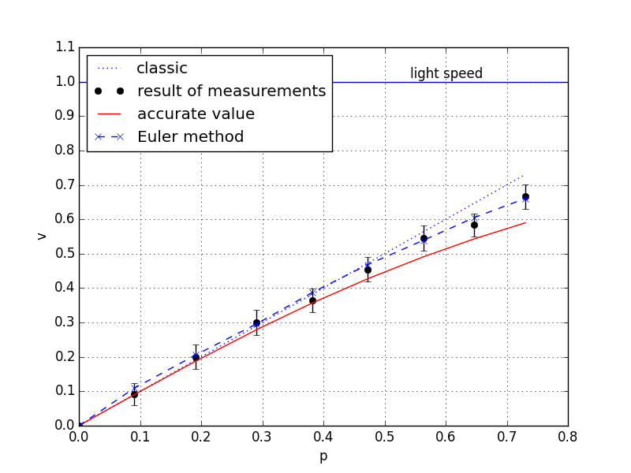
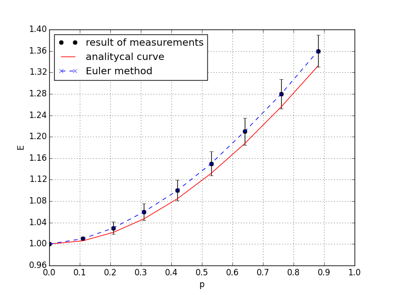

# Velocity, momentum, and energy
  
## 1. Experiment description
We consider motion of charge *q* in constant electric field *E*. Motion equation is  

\begin{equation}
    \frac{dp}{dt} = qE
\end{equation}
where p - particle momentum, qE - force. Initial condition is *x* = 0, *p* = 0 in moment *t* = 0.  
We find dependence  
- particle coordinate x from time t
- particle velocity v from momentum p
- particle energy E from momentum p.  

The data of the experiments are given in SI (International System of Units). The unit of time is light meter, i.e 1 [lm] = 1 [m] / c [m/c], wher c is speed of light, then *c* = 1. 
  
Parameters of computing is m = 1 kg (rest mass particle), qE = 0.1 (i.e.\\(0.1c^2\\) [N])  
Variable values:  
countTick= 8, sizeTick= 10  
Particle velosety = 0  (initial velocity)  
nu_t = 10.0 , nu_x = 10.0 , nu_m = 1.0  
mass = 1 , lightVel = 1.0  
  
With an increase in resolution, the measurement accuracy increases markedly, therefore, we consider an experiment with a minimum resolution, which is more indicative. Let the resolution of the time step be 10 elements of the unidirectional Temp list. The absolute error in the measurement of coordinates and time will then be 0.5. 
With this resolution, you can perform 8 clock cycles of the system (then an error typical of relativistic models arises, which can be called “synchronization failure”, you need to increase the resolution).  


## 2. Results of experiment

The results are shown in Table 1.  
```
Analytical (xa, pa, va) and numerical (xe) solution
+----+-----+-----+------+------+------+------+-----+------+
| Tw |  t  |  x  |  xa  |  xe  |  p   |  pa  |  v  |  va  |
+----+-----+-----+------+------+------+------+-----+------+
| 0  | 0.0 | 0.0 | 0.0  | 0.0  | 0.0  | 0.0  | 0.0 | 0.0  |
| 1  | 1.1 | 0.1 | 0.06 | 0.0  | 0.09 | 0.11 | 0.0 | 0.11 |
| 2  | 2.1 | 0.3 | 0.22 | 0.11 | 0.19 | 0.21 | 0.0 | 0.21 |
| 3  | 3.1 | 0.6 | 0.47 | 0.31 | 0.29 | 0.31 | 0.0 | 0.3  |
| 4  | 4.2 | 1.0 | 0.85 | 0.64 | 0.38 | 0.42 | 0.0 | 0.39 |
| 5  | 5.3 | 1.5 | 1.32 | 1.07 | 0.47 | 0.53 | 0.0 | 0.47 |
| 6  | 6.4 | 2.1 | 1.87 | 1.58 | 0.56 | 0.64 | 1.0 | 0.54 |
| 7  | 7.6 | 2.8 | 2.56 | 2.23 | 0.65 | 0.76 | 1.0 | 0.61 |
| 8  | 8.8 | 3.6 | 3.32 | 2.95 | 0.73 | 0.88 | 1.0 | 0.66 |
+----+-----+-----+------+------+------+------+-----+------+
```
Following is an example of a graphic and caption (“Figure” style).
  
Figure 1. Motion plot  
  
The data are presented so that speed and energy can be considered as functions of the momentum.  
```  
Velocity end energy of particle as function from momentum  
+----+------+------+------+--------+------+------+--------+
| Tw |  p   |  v   |  va  | v,err% |  E   |  Ea  | E,err% |
+----+------+------+------+--------+------+------+--------+
| 0  | 0.0  | 0.0  | 0.0  |  0.0   | 1.0  | 1.0  |  0.0   |
| 1  | 0.09 | 0.09 | 0.09 |  0.41  | 1.01 | 1.0  |  0.41  |
| 2  | 0.19 | 0.2  | 0.19 |  6.65  | 1.03 | 1.02 |  1.0   |
| 3  | 0.29 | 0.3  | 0.28 |  7.4   | 1.06 | 1.04 |  1.61  |
| 4  | 0.38 | 0.36 | 0.36 |  1.94  | 1.09 | 1.07 |  1.95  |
| 5  | 0.47 | 0.45 | 0.43 |  6.36  | 1.13 | 1.11 |  2.4   |
| 6  | 0.56 | 0.55 | 0.49 | 11.09  | 1.18 | 1.15 |  2.99  |
| 7  | 0.65 | 0.58 | 0.54 |  7.39  | 1.23 | 1.19 |  3.34  |
| 8  | 0.73 | 0.67 | 0.59 | 13.04  | 1.29 | 1.24 |  3.89  |
+----+------+------+------+--------+------+------+--------+
```  
The following notation is introduced in this table: Tw is the system time step number, p is the measured pulse, v is the measured speed, va is the exact value of the speed, v, err% is the relative error of the speed measurement in%, E is the measured energy, Ea is the exact energy value, E, err% - relative error of energy measurement in %.  
Plot of the dependence of speed on momentum are shown in Fig. 2.  
  
Figure 2. Velocity as function from momentum  
  
Points are measurement data, a continuous line is an analytical curved. Dash line is numerical solution (Euler method). For clarity, a plot of the dependence of speed on momentum for the classical case is also given (straight line).  
Plot of the dependence of energy on momentum are shown in Fig. 3.  
  
Figure 3. Energy as function from momentum
  
Points are measurement data, a continuous line is an analytical curved. Dash line is numerical solution (Euler method). 
  
## 3. Description of experiment3 modul

### Class "simpleIteraction"
Description: the class is a simulation model  
Bases: mms.Composite    
`def __init__(self, sizeTick, countTick, particle_velosety, observer)`  
  
Name | Type | Description  
---- | ---- | ----------- 
sizeTick | int | size of time tact
countTick | int | count of tacts
particle_velosety | int | inicial speed particle
observer | Table instance | Detector and recorder
  
#### Operations: 
def interaction(self, car)  
Description:  action of electric field  
Parameters: "car" is "Currer" instance  
    
### Class "originalToolkit"   
Description: new procedures join to processor of data  
Bases: ResacherInstruments.DataProcessing    
`def __init__(self, observer,particle_velosety, sizeTick, countTick)`  
  
Name | Type | Description  
---- | ---- | ----------- 
observer | Table instance | Detector and recorder
particle_velosety | int | inicial speed particle
sizeTick | int | size of time tact
countTick | int | count of tacts

#### Attributes: 
  
Name | Type | Description  
---- | ---- | ----------- 
xAtrack | int array | x, analitical solution  
xNtrack | int array| x, numerical solution 
pA | int array| momentum, analitical solution  
vA | int array| velocity, analitical solution  
vN | int array| velocity, numerical solution
eN | int array| energy, numerical solution
  
  
#### Operations: 
**def anlSolution(self)**  
Description: accurate x (analytical formula)  
Parameters: None  
  
Algorithm: 
  
$$
\begin{align*} 
x = \frac{mc^2}{qE}{\sqrt{ 1 + (\frac{qEt}{mc^2})^2 } -1}  (2) \\  
v = c \sqrt{\frac{(qEt/mc)^2}{1+(qEt/mc)^2} }  (3) \\  
\end{align*} 
$$  

**def numSolution(self)**  
Description: numerical solution of motion differential equation  (Euler method)   
Parameters: None  
  
Algorithm: 
  
$$
\begin{equation}
p_{i} = p_{i-1} + qE \Delta t  \\
v_{i} = \frac{p_{i-1} {\sqrt{m^2 + \frac{p^2}{c^2} } \\  
x_{i} = x_{i-1} + v_{i-1} \Delta t  \\  
e_{i} = e_{i-1} + qE \Delta x
\end{equation}  
$$  
  
where \\(p_{0} = 0\\), \\(v_{0} = 0\\),  \\(e_{0} = mc^2\\)  
  
Value \\(x_{i}\\) write to array *xNtrack*, value \\(v_{i}\\) write to array *vN*, value \\(e_{i}\\) write to array *eN*
    
    
