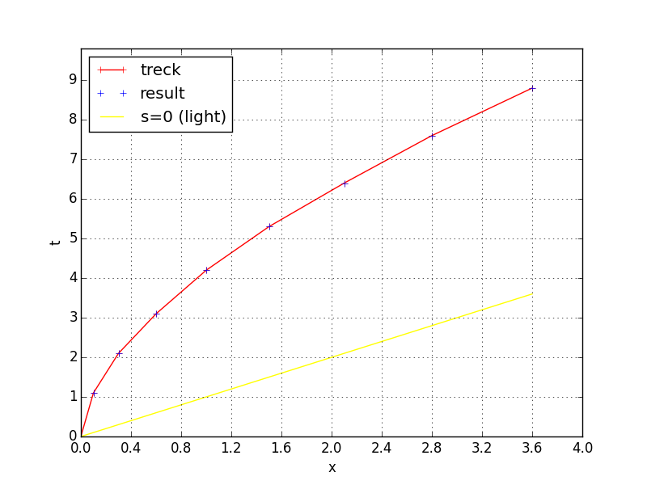
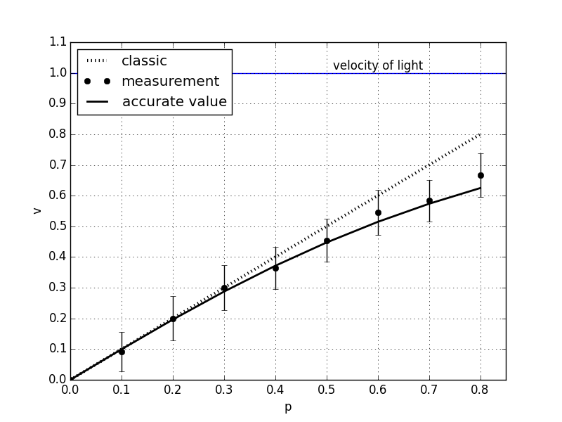
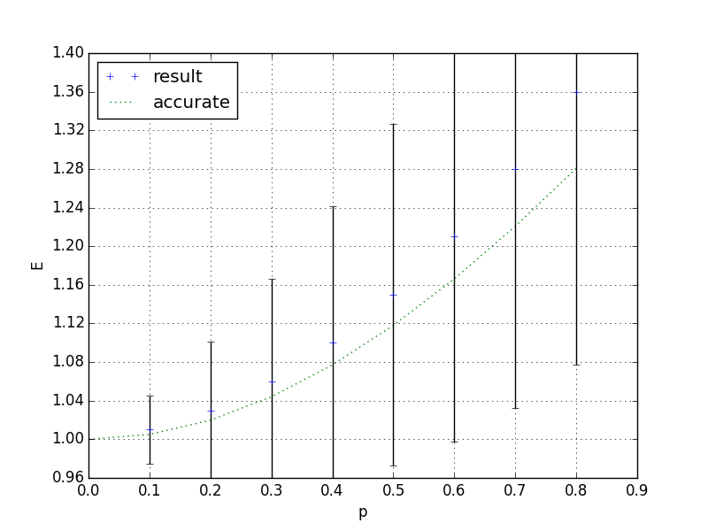

Velocity, momentum, and energy

The results of the experiments. Consider the following characteristic experiment. Let a charged electric field be affected by a constant electric field in the direction of motion

We put qE = 1, the rest mass of the particle is m = 1, the particle initially rests at the origin of the laboratory reference frame.
With an increase in resolution, the measurement accuracy increases markedly, therefore, we consider an experiment with a minimum resolution, which is more indicative. Let the resolution of the time step be 10 elements of the unidirectional Temp list. The absolute error in the measurement of coordinates and time will then be 0.05. The numerical results of the experiments are given in natural units (conversion to GHS or SI, see [3]), the speed of light c = 1.
With this resolution, you can perform 8 clock cycles of the system (then an error typical of relativistic models arises, which can be called “synchronization failure”, you need to increase the resolution). The results are shown in Table 1. The data are presented so that speed and energy can be considered as functions of the momentum.
Following is an example of a graphic and caption (“Figure” style).
  
Figure 2. Use-Case diagram 

The following notation is introduced in this table: No. is the system time step number, p is the measured pulse, v is the measured speed, va is the exact value of the speed, v, err% is the relative error of the speed measurement in%, E is the measured energy, Ea is the exact energy value, E, err% - relative error of energy measurement in%
The exact speed value is calculated by the formula
  
Figure 2. Use-Case diagram 

The exact energy value is calculated by the formula
  
Figure 2. Use-Case diagram 
Graphs of the dependence of speed on momentum are shown in Fig. 1. Points are measurement data, a continuous line is an analytical curve. For clarity, a graph of the dependence of speed on momentum for the classical case is also given (straight line).
