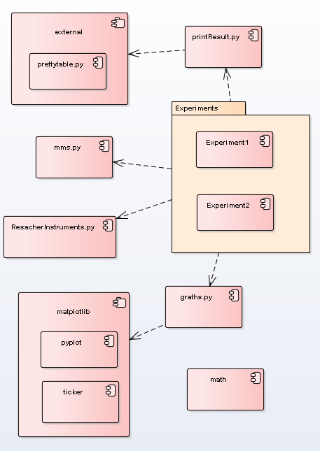

# Package Overview
Both Experiment1 and  Experiment2 moduls are run moduls. Modules use other modules for execution, Gig.5. 

  
Figure 5. Component diagram  
The run modules include six sections, it are
- concrete classes;
- definition parameters;
- execution section;
- data processing section;
- print section;
- visualisation section.

see code of modules^
- Experiment1.py
- Experiment2.py
