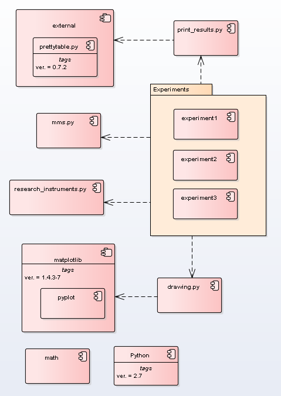

# Package Overview
All  *Experiment* modules are executing modules. Modules use other modules for work, Fig.5.  

  
Figure 5. Component diagram  
The run modules include six sections, it are
- concrete classes;
- definition parameters;
- execution section;
- data processing section;
- print section;
- visualization section.

see code of modules
- Experiment1.py
- Experiment2.py
- Experiment3.py
