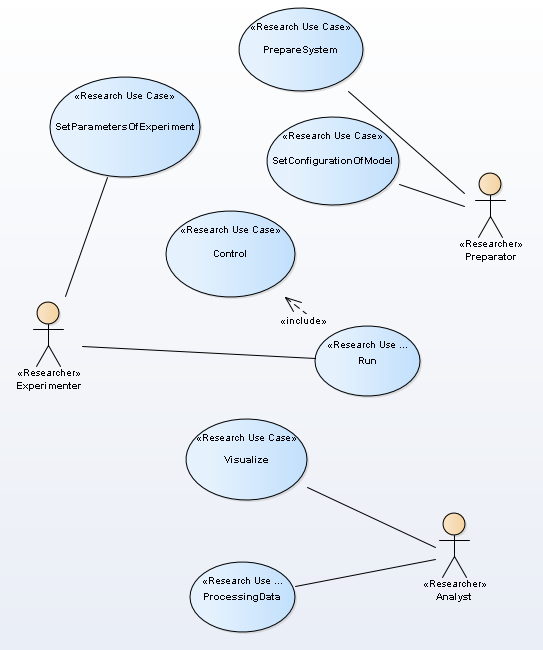

# Use-Case model
Use case modeling is a form of requirements engineering. Use Case model defines functional requirements for software.   

  
Figure 2. Use-Case diagram 
  
The main script is Use-Case "Run".  
  
## Use case: Run
   
* **Short description:** execution experiment
* **Actor:** Experimenter
* **Preconditions:** System is prepare, parameters is define 
* **Flow of events:**   
1. The use case starts when Experimenter execution operation Run   
2. While time isn't stop   
2.1. step motion  
2.2. control print  
2.3. next moment of time   
* **Postconditions:** Data table is full  
* **Alternative script:**  
1. syncError  

  

