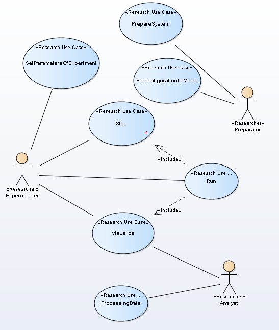

# Use-Case model
Use case modeling is a form of requirements engineering. Use Case model define functional requirements to softvare.   

  
Figure 2. Use-Case diagram 
  
  Use case: Run

    • Short description: execution experiment
    • Actor: Experimenter
    • Preconditions: System is prepare, parameters is define
    • Flow of events:
    1. The use case starts when Experimenter execution operation Run
    2. While time isn't stop
	2.1. step motion
	2.2. control print 
      next moment of time
    • Postconditions: Data table is full
    • Secondary scenarios:
    1. syncError
